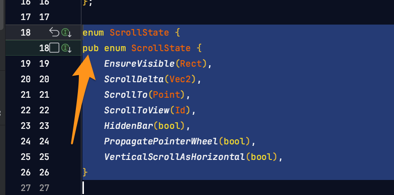
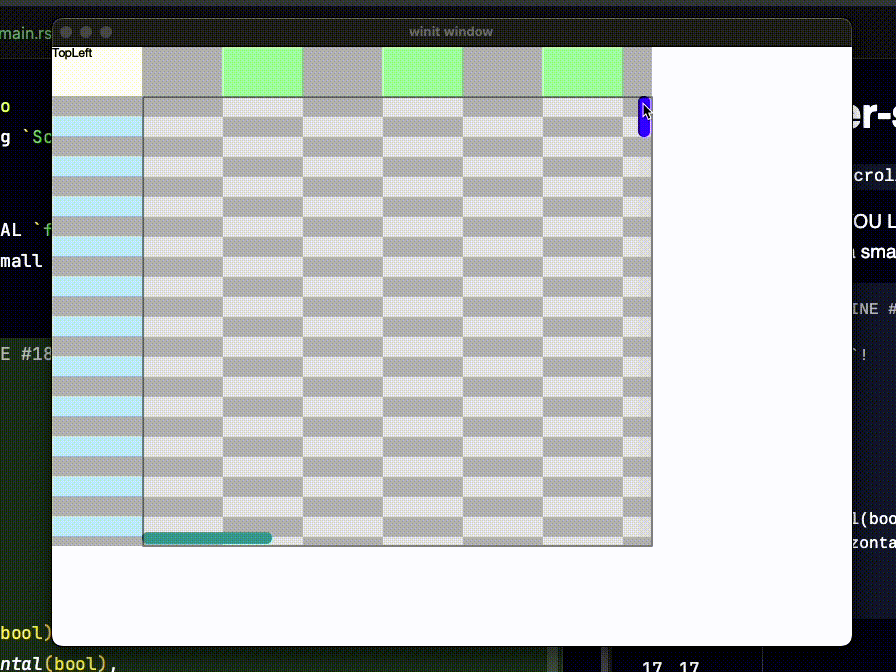

# floem-scroller-sync-proto
exploratory app for syncing `Scroll` views in the `floem` toolkit for Rust.


* CHANGE NEEDED TO YOU LOCAL `floem` DIRECTORY
  * This demo requires a small edit to the current `floem` source:

```rust
// src/views/scroll.rs LINE #18
//enum ScrollState {
// make ScrollState `pub`!
pub enum ScrollState {
    EnsureVisible(Rect),
    ScrollDelta(Vec2),
    ScrollTo(Point),
    ScrollToView(Id),
    HiddenBar(bool),
    PropagatePointerWheel(bool),
    VerticalScrollAsHorizontal(bool),
}

```


I will submit a PR for this change, hopefully making it `pub` is not a problem, otherwise need a way to access `ScrollState` to get this to work.

### Preview
